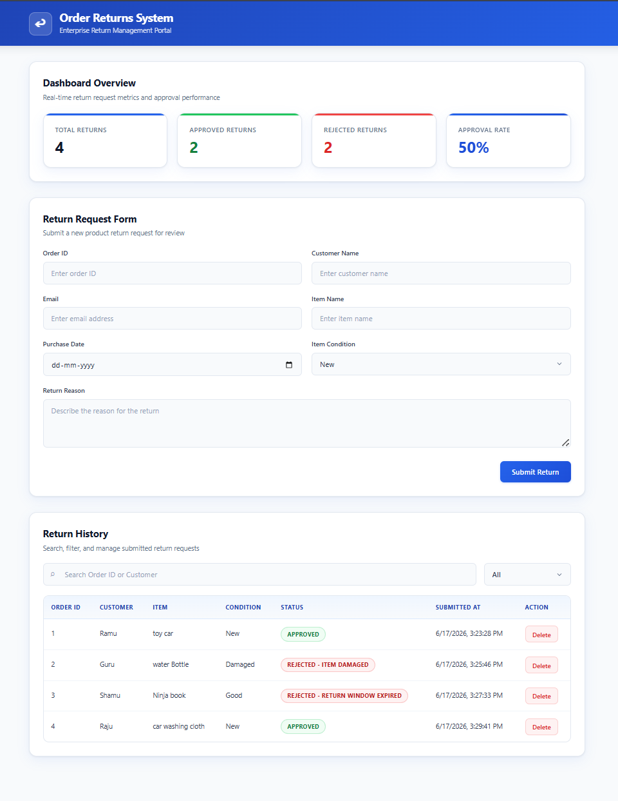

<div style="page-break-after: always;"></div>

# Order Returns System

## Interview Submission Document

<br><br><br>

| | |
|---|---|
| **Project** | Order Returns System |
| **Candidate** | Navanith Krishna R |
| **Degree** | B.E. Computer Science and Engineering |
| **Institution** | BMS College of Engineering |
| **GitHub Repository** | https://github.com/navanith-krishna/order-returns-system |
| **Document** | Interview_Submission_Order_Returns_System.pdf |
| **Date** | June 2026 |

<br><br>

*Full-stack enterprise web application for managing product return requests with automated approval logic, REST API persistence, and MongoDB Atlas cloud storage.*

<div style="page-break-after: always;"></div>

## 2. Project Summary

The **Order Returns System** is a full-stack web application that simulates an enterprise return-management portal. Users submit product return requests through a React dashboard; the system evaluates each request against business rules, assigns an approval status, and persists records to MongoDB Atlas via a Node.js REST API.

**Problem addressed:** E-commerce and retail operations need a centralized way to accept return requests, enforce return policies consistently, and track approval metrics without manual status decisions.

**Solution delivered:** A single-page dashboard with form submission, automatic status calculation, live analytics (total / approved / rejected / approval rate), searchable return history, status filtering, and delete-with-confirmation — all backed by a cloud database.

**What I built:**

| Layer | Responsibility |
|-------|----------------|
| **Frontend** | React UI, form validation, business-rule engine, API integration, dashboard analytics |
| **Backend** | Express REST API, Mongoose data model, error handling, MongoDB connection |
| **Database** | MongoDB Atlas — `orderReturns` database, `returns` collection |

**Core user flow:**

1. User fills the return form (Order ID, customer details, item, purchase date, condition, reason).
2. Frontend validates input and computes status using `returnLogic.js`.
3. Approved or rejected record is sent to `POST /api/returns` and saved in Atlas.
4. Dashboard refreshes — stats cards and history table update immediately.
5. User can search, filter, or delete records as needed.

**Skills demonstrated:** Full-stack JavaScript, REST API design, MongoDB schema modeling, React component architecture, async state management, form validation, responsive CSS, environment-based configuration, and cloud database integration.

<div style="page-break-after: always;"></div>

## 3. Technology Stack Summary

| Layer | Technologies |
|-------|-------------|
| **Frontend** | React 19, Vite 8, Axios, CSS3 (custom design system) |
| **Backend** | Node.js, Express 5, Mongoose 9, CORS, dotenv |
| **Database** | MongoDB Atlas (cloud-hosted NoSQL) |
| **Dev Tools** | ESLint, Nodemon, Git |

**Why these choices:**

- **React + Vite** — Fast development, component reusability, modern tooling.
- **Express** — Lightweight, well-understood REST framework for CRUD APIs.
- **MongoDB Atlas** — Flexible document storage; no local DB setup required for demos.
- **Axios** — Clean HTTP client with interceptors and error handling support.
- **Custom CSS** — Full control over enterprise dashboard styling without UI library overhead.

---

## 4. System Architecture Diagram

```
┌──────────────────────────────────────────────────────────────────────────┐
│                           CLIENT (Browser)                               │
│  ┌────────────────────────────────────────────────────────────────────┐  │
│  │  React SPA  —  localhost:5173                                      │  │
│  │  ┌─────────────┐  ┌──────────────┐  ┌─────────────────────────┐  │  │
│  │  │ ReturnForm  │  │ ReturnTable  │  │ DashboardStats          │  │  │
│  │  └──────┬──────┘  └──────┬───────┘  └───────────┬─────────────┘  │  │
│  │         │                │                       │                 │  │
│  │         └────────────────┼───────────────────────┘                 │  │
│  │                          ▼                                         │  │
│  │              returnService.js  (Axios)                             │  │
│  │              returnLogic.js    (Status Engine)                     │  │
│  └──────────────────────────┬───────────────────────────────────────┘  │
└─────────────────────────────┼──────────────────────────────────────────┘
                              │  HTTP REST  (JSON)
                              ▼
┌──────────────────────────────────────────────────────────────────────────┐
│                      SERVER  —  localhost:5000                           │
│  ┌────────────────────────────────────────────────────────────────────┐  │
│  │  Express 5                                                         │  │
│  │  /api/returns  →  returnRoutes  →  returnController                │  │
│  │                      │                                             │  │
│  │              errorHandler / asyncHandler                           │  │
│  └──────────────────────────┬─────────────────────────────────────────┘  │
└─────────────────────────────┼──────────────────────────────────────────┘
                              │  Mongoose ODM
                              ▼
┌──────────────────────────────────────────────────────────────────────────┐
│                      MongoDB Atlas  (Cloud)                              │
│              Database: orderReturns  │  Collection: returns              │
└──────────────────────────────────────────────────────────────────────────┘
```

**Request lifecycle (Create):** Form submit → validate → calculate status → `POST /api/returns` → Mongoose save → `201` response → reload dashboard data.

---

## 5. API Summary

**Base URL:** `http://localhost:5000/api/returns`

| Method | Endpoint | Description | Response |
|--------|----------|-------------|----------|
| `GET` | `/api/returns` | Retrieve all return records | `200` — JSON array |
| `POST` | `/api/returns` | Create a new return request | `201` — saved JSON object |
| `DELETE` | `/api/returns/:id` | Delete by MongoDB `_id` | `200` — `{ "message": "Deleted successfully" }` |

**POST body (key fields):** `orderId`, `customerName`, `email`, `itemName`, `reason`, `condition`, `status`, `submittedAt`

**Example POST:**

```json
{
  "orderId": "ORD-001",
  "customerName": "Jane Doe",
  "email": "jane@example.com",
  "itemName": "Wireless Headphones",
  "reason": "Wrong size",
  "condition": "New",
  "status": "Approved",
  "submittedAt": "6/17/2026, 10:30:00 AM"
}
```

**Error handling:** Validation failures and duplicate `orderId` return `400`; unhandled errors return `500` with `{ "error": "..." }`.

---

## 6. Business Rules

Status is computed in `frontend/src/utils/returnLogic.js` before submission:

| Condition | Result |
|-----------|--------|
| Purchase date is in the future | `Invalid Purchase Date` |
| More than 30 days since purchase | `Rejected - Return Window Expired` |
| Item condition is **Damaged** | `Rejected - Item Damaged` |
| Within 30 days AND condition is **New** or **Good** | `Approved` |

**Additional validation:** All fields required · email must contain `@` · duplicate Order ID blocked (frontend + DB unique index) · purchase date cannot be future-dated in form.

<div style="page-break-after: always;"></div>

## 7. AI Tools Used

| Tool | How It Was Used |
|------|-----------------|
| **Cursor AI** | Refactoring, UI redesign, debugging, documentation, project restructuring |
| **GitHub Copilot** | Boilerplate code and React component scaffolding during initial build |

All AI-generated code was reviewed, tested manually, and integrated with understanding of the full stack.

---

## 8. Key Challenges and Solutions

| Challenge | Solution |
|-----------|----------|
| **Consistent return policy enforcement** | Extracted status logic into a dedicated `returnLogic.js` module, separate from UI components |
| **Duplicate Order ID submissions** | Case-insensitive check on frontend + Mongoose `unique: true` on `orderId` with centralized error handler |
| **Keeping dashboard in sync after CRUD** | `loadReturns()` callback re-fetches data after every create/delete; stats derived from fresh state |
| **Graceful API error handling** | Backend `errorHandler` middleware + frontend `AlertMessage` component with user-friendly messages |
| **MongoDB Atlas connectivity** | Environment-based `MONGO_URI` in `.env`; connection retry exits process on failure for clear startup feedback |
| **Professional UI without a component library** | Custom CSS design system with panel layout, stat cards, status badges, and responsive breakpoints |
| **Destructive delete actions** | `ConfirmDialog` modal prevents accidental deletion; shows Order ID in confirmation message |

---

## 9. Screenshots Section

> Add images to `screenshots/` before exporting. Recommended size: 1200px wide.

### Dashboard Overview



*Stats cards, return form, and history table.*

### Search Functionality


*Real-time filtering as the user types in the search box.*

### Filter Functionality


*Status dropdown filters the return history table.*

### MongoDB Atlas Records


*Persisted documents in the `orderReturns.returns` collection.*

### API Response


*Sample `GET` or `POST` response from the backend API.*

<div style="page-break-after: always;"></div>

## 10. Interview Talking Points

Use these as quick reference when discussing the project with an interviewer.

### Elevator pitch (30 seconds)

*"I built a full-stack Order Returns System where users submit return requests through a React dashboard. The app automatically approves or rejects each request based on a 30-day window and item condition, stores everything in MongoDB Atlas through an Express REST API, and shows live approval metrics on the dashboard."*

### Architecture & design

- **Why separate frontend and backend?** Clear separation of concerns — UI logic vs. data persistence; API can serve multiple clients later.
- **Why MongoDB?** Flexible schema for return documents; Atlas removes local DB setup for demos and interviews.
- **Why calculate status on the frontend?** Keeps the backend thin for this scope; in production I would move validation to the server for security.
- **Component structure:** Presentational components (`ReturnForm`, `ReturnTable`, `DashboardStats`) orchestrated by `DashboardPage` with API calls in `returnService.js`.

### Technical depth questions

| If asked… | Talk about… |
|-----------|-------------|
| *How do you prevent duplicate orders?* | Frontend array check + Mongoose unique index on `orderId`; MongoDB error code `11000` mapped to `400` |
| *How does the dashboard stay updated?* | `useCallback` + `useEffect` for initial load; explicit re-fetch after POST/DELETE |
| *What happens if the API is down?* | Axios catch blocks set error alerts; loading spinner during fetch |
| *How would you add authentication?* | JWT middleware on Express routes; protected React routes; user-scoped queries |
| *How would you improve this for production?* | Server-side validation, input sanitization, pagination, unit tests, CI/CD, rate limiting |

### What I learned

- End-to-end feature delivery: UI → API → database → back to UI
- Designing REST endpoints around real CRUD workflows
- Balancing client-side UX (instant validation) with server-side data integrity (unique constraints)
- Structuring a React app for readability and interview walkthroughs

### Honest trade-offs (shows maturity)

- Purchase date is used for status calculation but not stored in MongoDB
- No authentication — acceptable for a portfolio/demo project
- Business rules run client-side; would refactor to shared validation module or server middleware for production

---

## PDF Export Instructions

1. Replace the GitHub URL on the cover page if your repository link differs.
2. Add five screenshots to the `screenshots/` folder (filenames above).
3. Open this file in **Cursor / VS Code** with the *Markdown PDF* extension.
4. Export as **`Interview_Submission_Order_Returns_System.pdf`**.
5. Print double-sided or single-sided — document targets **3–5 pages** excluding full-page screenshots.

---

*Navanith Krishna R · BMS College of Engineering · Order Returns System · 2026*
